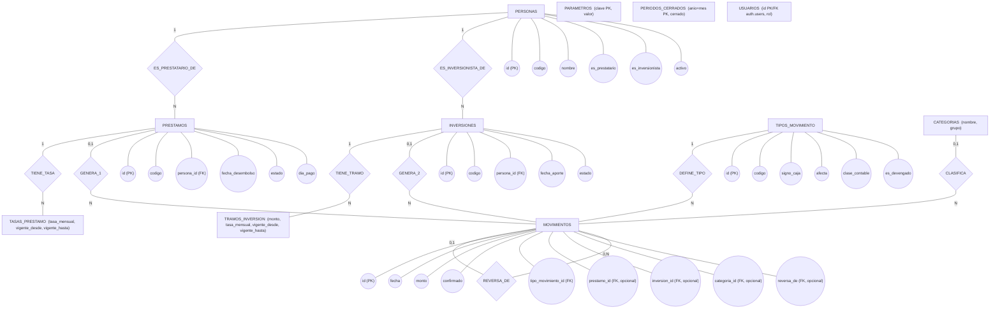
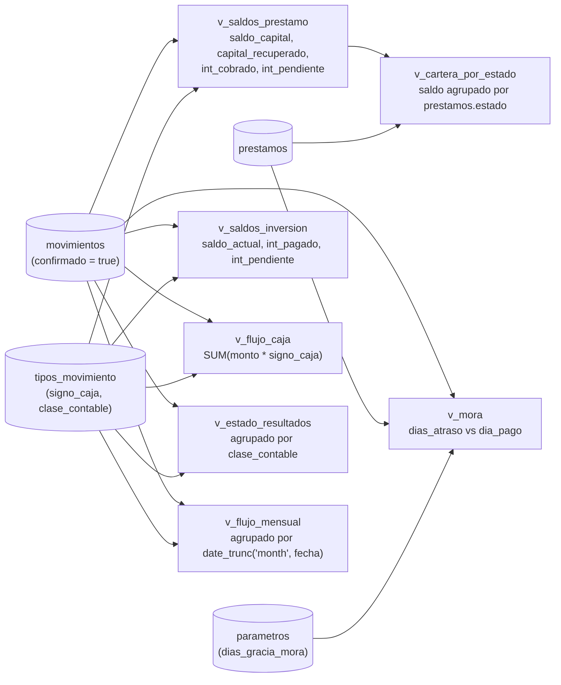

# Diagrama entidad-relación y flujo de datos — Cooperativa (HNL)

Este documento acompaña a `supabase/migrations/`. Contiene:

1. Diagrama entidad-relación en **notación Chen** (entidades = rectángulo, relaciones = rombo, atributos = óvalo).
2. Diagrama entidad-relación en **notación IE / "pata de gallo"** (la que renderiza Mermaid de forma nativa, la más parecida a lo que se ve en Supabase Studio).
3. **Storytelling** del flujo de datos: qué pasa, en orden, desde que se registra una persona hasta que se lee un saldo.
4. Cómo se alimentan las vistas (`v_*`) a partir de la tabla de hechos.

> Para verlos renderizados: abrí este archivo en VS Code con la extensión "Markdown Preview Mermaid Support" (o cualquier visor que soporte bloques ` ```mermaid `), o pegalo en GitHub/GitLab, que renderizan Mermaid nativamente.

---

## 1. Diagrama Chen

Por legibilidad, los atributos completos (óvalos) solo se muestran en las **entidades centrales de la historia** (`PERSONAS`, `PRESTAMOS`, `INVERSIONES`, `MOVIMIENTOS`, `TIPOS_MOVIMIENTO`). Las tablas de catálogo secundarias (`TASAS_PRESTAMO`, `TRAMOS_INVERSION`, `CATEGORIAS`, `PARAMETROS`, `PERIODOS_CERRADOS`, `USUARIOS`) listan sus atributos clave dentro del propio rectángulo, para no saturar el gráfico. El DDL completo (todas las columnas, checks, defaults) está en `supabase/migrations/`.



**Nota sobre `PARAMETROS` y `PERIODOS_CERRADOS`:** no tienen línea de relación con `MOVIMIENTOS` porque no son llave foránea — el vínculo lo aplica un **trigger** (compara `extract(year/month from movimientos.fecha)` contra `periodos_cerrados.anio/mes`, y lee `parametros.dias_gracia_mora` desde la vista `v_mora`). En Chen puro eso no es una relación de datos, es una regla de negocio, así que se documenta aparte y no como rombo.

---

## 2. Diagrama entidad-relación (notación IE / pata de gallo)

Este es el que vas a ver más parecido en herramientas como Supabase Studio, dbdiagram.io, etc. `||--o{` = "uno, obligatorio" del lado izquierdo contra "cero o muchos" del lado derecho.

```mermaid
erDiagram
    AUTH_USERS {
        uuid id PK
    }
    USUARIOS {
        uuid id PK_FK
        text rol
    }
    PERSONAS {
        bigint id PK
        text codigo
        text nombre
        text identidad
        boolean es_prestatario
        boolean es_inversionista
        boolean activo
    }
    PRESTAMOS {
        bigint id PK
        text codigo
        bigint persona_id FK
        date fecha_desembolso
        text estado
        int plazo_meses
        int dia_pago
    }
    TASAS_PRESTAMO {
        bigint id PK
        bigint prestamo_id FK
        numeric tasa_mensual
        date vigente_desde
        date vigente_hasta
    }
    INVERSIONES {
        bigint id PK
        text codigo
        bigint persona_id FK
        date fecha_aporte
        text estado
    }
    TRAMOS_INVERSION {
        bigint id PK
        bigint inversion_id FK
        numeric monto
        numeric tasa_mensual
        date vigente_desde
        date vigente_hasta
    }
    TIPOS_MOVIMIENTO {
        bigint id PK
        text codigo
        smallint signo_caja
        text afecta
        text clase_contable
        boolean es_devengado
    }
    CATEGORIAS {
        bigint id PK
        text nombre
        text grupo
    }
    MOVIMIENTOS {
        bigint id PK
        date fecha
        bigint tipo_movimiento_id FK
        bigint prestamo_id FK
        bigint inversion_id FK
        bigint categoria_id FK
        numeric monto
        boolean confirmado
        bigint reversa_de FK
        uuid created_by FK
    }
    PARAMETROS {
        text clave PK
        text valor
    }
    PERIODOS_CERRADOS {
        int anio PK
        int mes PK
        boolean cerrado
    }

    AUTH_USERS   ||--o|  USUARIOS         : "tiene rol de app"
    AUTH_USERS   ||--o{  MOVIMIENTOS      : "crea (created_by)"
    PERSONAS     ||--o{  PRESTAMOS        : "es prestatario de"
    PERSONAS     ||--o{  INVERSIONES      : "es inversionista de"
    PRESTAMOS    ||--o{  TASAS_PRESTAMO   : "tiene historial de tasa"
    INVERSIONES  ||--o{  TRAMOS_INVERSION : "tiene tramos de"
    PRESTAMOS    ||--o{  MOVIMIENTOS      : "genera"
    INVERSIONES  ||--o{  MOVIMIENTOS      : "genera"
    CATEGORIAS   ||--o{  MOVIMIENTOS      : "clasifica"
    TIPOS_MOVIMIENTO ||--o{ MOVIMIENTOS   : "define signo/clase de"
    MOVIMIENTOS  ||--o|  MOVIMIENTOS      : "reversa_de (auto-referencia)"
```

`AUTH_USERS` es la tabla gestionada por Supabase Auth (`auth.users`), no forma parte del modelo de negocio — se incluye solo para mostrar de dónde cuelgan `usuarios.id` y `movimientos.created_by`.

`PARAMETROS` y `PERIODOS_CERRADOS` quedan sin líneas: son catálogos leídos por triggers/vistas (`dias_gracia_mora`, cierre de período), no por llave foránea.

---

## 3. Storytelling del flujo de datos

La idea del esquema es que **nada se borra ni se sobrescribe**: la historia completa de la cooperativa vive en `movimientos`, y todo lo demás (saldos, cartera, flujo de caja) se *deriva* leyendo esa historia. Así se ve en orden cronológico:

### Paso 1 — Alta de una persona
Se crea una fila en `personas` (código, nombre, identidad, si es prestatario/inversionista o ambos). Todavía no hay plata moviéndose, es solo el "quién".

### Paso 2 — Se abre un préstamo o una inversión
- **Préstamo:** fila en `prestamos` (`persona_id`, `fecha_desembolso`, `estado = 'ACTIVO'`, `dia_pago`) + una fila inicial en `tasas_prestamo` con la tasa mensual vigente desde esa fecha (`vigente_hasta = null` mientras no cambie).
- **Inversión:** fila en `inversiones` (`persona_id`, `fecha_aporte`, `estado = 'VIGENTE'`) + una fila en `tramos_inversion` con el monto y la tasa de ese tramo.

En este punto, el préstamo/inversión existen como "contrato", pero **todavía no movieron un centavo** — eso solo lo registra `movimientos`.

### Paso 3 — Cada evento de dinero es una fila en `movimientos`
Ejemplos según `tipos_movimiento`:
- Se desembolsa el préstamo → `DESEMBOLSO` (sale caja, `signo_caja = -1`).
- El cliente abona → `ABONO_CAPITAL` (entra caja, `signo_caja = +1`).
- Se cobra interés → `INTERES_COBRADO` (entra caja, ingreso).
- Se reconoce interés devengado aún no cobrado → `INTERES_PENDIENTE` (no mueve caja, `signo_caja = 0`, pero sí es ingreso contable).
- Un inversionista aporta → `APORTE_INVERSION`; se le devuelve capital → `DEVOLUCION_INVERSION`; se le paga interés → `INTERES_PAGADO_INV`.
- Gastos/ingresos que no son de un préstamo ni de una inversión (ej. "Gastos de colocación", "Interés bancario") van con `categoria_id` en vez de `prestamo_id`/`inversion_id`.

Cada fila nace con `confirmado = false` u opcionalmente `true` si ya está validada; **nunca se actualiza ni se borra el resto de columnas** — eso lo bloquean los triggers `trg_movimientos_no_delete` y `trg_movimientos_solo_confirmado`. Antes de insertarse, otro trigger revisa que el `(año, mes)` de la fecha no esté en `periodos_cerrados` con `cerrado = true`.

### Paso 4 — Confirmación
Un `admin` revisa el movimiento y cambia `confirmado` a `true` (es la única columna editable). Solo movimientos `confirmado = true` entran en los cálculos de `v_flujo_caja`, `v_saldos_prestamo`, `v_saldos_inversion`, `v_estado_resultados` y `v_flujo_mensual`.

### Paso 5 — Corrección de un error
Si algo se registró mal, **no se edita ni se borra** — se inserta una nueva fila en `movimientos` con `reversa_de = <id del movimiento erróneo>` y el efecto contrario. La historia completa (el error y su corrección) queda visible para siempre.

### Paso 6 — Lectura de saldos (las vistas)
Nadie consulta una columna de "saldo": todo se recalcula on-the-fly sumando la historia de `movimientos` con su `signo_caja`. Ver sección 4.

### Paso 7 — Cierre de período
A fin de mes, un `admin` marca `periodos_cerrados (anio, mes, cerrado = true)`. Desde ese momento, cualquier intento de insertar un movimiento con fecha en ese mes es rechazado por trigger — el libro de ese mes queda "sellado".

### Paso 8 — Quién puede ver/tocar qué (RLS)
- **admin**: puede hacer todo, incluyendo editar catálogos (`tipos_movimiento`, `parametros`), cerrar períodos y confirmar movimientos.
- **operador**: da de alta personas y préstamos, e inserta movimientos (el día a día de la cooperativa), pero no puede confirmar movimientos ni tocar catálogos.
- **consulta**: no toca ninguna tabla directamente — solo puede leer las vistas `v_*`, que ya vienen con los números calculados (saldos, cartera, flujo de caja).

---

## 4. Cómo se alimentan las vistas

Todas las vistas leen `movimientos` (filtrando `confirmado = true`), nunca al revés — son de solo lectura, no hay columnas de saldo en ninguna tabla.



| Vista | Responde | Insumos |
|---|---|---|
| `v_saldos_prestamo` | ¿Cuánto capital e interés debe cada préstamo? | `movimientos` + `tipos_movimiento` |
| `v_saldos_inversion` | ¿Cuánto se le debe a cada inversionista? | `movimientos` + `tipos_movimiento` |
| `v_flujo_caja` | ¿Cuánto efectivo neto movió la cooperativa en toda su historia? | `movimientos` + `tipos_movimiento` |
| `v_cartera_por_estado` | ¿Cuánto capital hay ACTIVO / PAGADO / CONGELADO / INCOBRABLE? | `v_saldos_prestamo` + `prestamos.estado` |
| `v_estado_resultados` | ¿Cuánto es BALANCE vs. INGRESO vs. GASTO? | `movimientos` + `tipos_movimiento` |
| `v_flujo_mensual` | ¿Cómo se ve el flujo de caja mes a mes? | `movimientos` + `tipos_movimiento`, agrupado con `date_trunc` |
| `v_mora` | ¿Qué préstamos ACTIVO están atrasados y por cuántos días? | `prestamos.dia_pago` + último abono/interés cobrado + `parametros.dias_gracia_mora` |

---

## Referencia

Esquema completo (DDL, triggers, RLS, seed) en `supabase/migrations/`. Ver `supabase/README.md` para el orden de aplicación y el estado pendiente de los 64 movimientos históricos de la prueba de aceptación.
